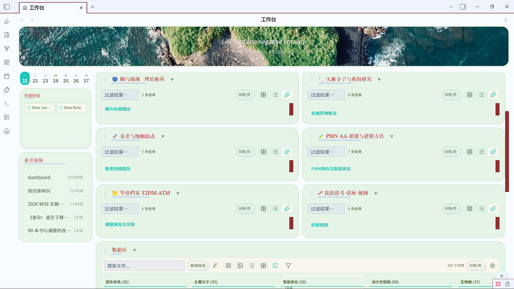
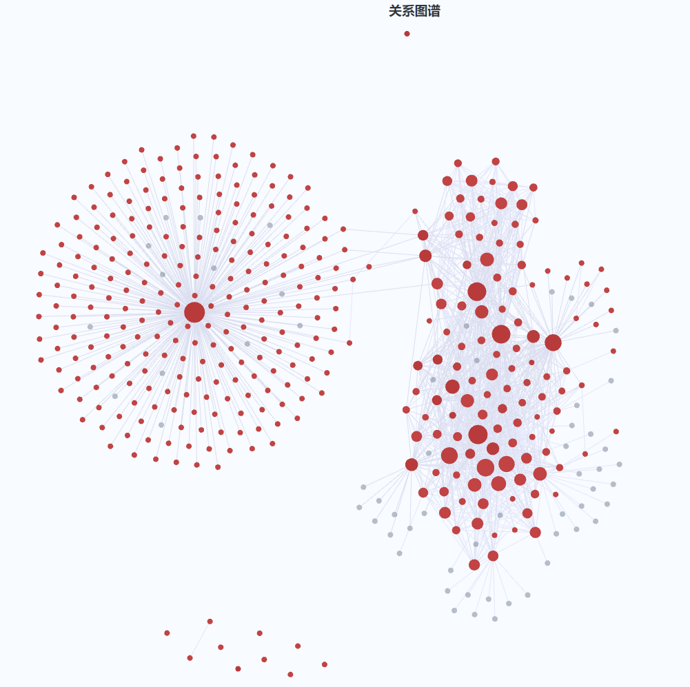

# 生物熵课题组 · 共享知识库

以 Obsidian 七列工作台为入口的知识库：从工作台一览全库、点击卡片直接跳转任意笔记。

## 🖼 知识库效果

**七列工作台**（1 张项目组主线 memo + 6 大研究域 + 底部数据库看板）：

<p align="center">
  
</p>

**文献关系网络图**（节点 = 笔记/文献，连边 = 共现关系）：

<p align="center">
  
</p>

## 🚀 如何上手

1. **安装 [Obsidian](https://obsidian.md/download)**（全平台免费）
2. **安装 2 个社区插件**（Obsidian → 设置 → 第三方插件 → 浏览）：
   - **Dataview** — 工作台列查询引擎
   - **Apex Dashboard** — 七列工作台
3. **克隆本仓库**：
   ```bash
   git clone https://github.com/mx18393212707/bioentropy-kb-public.git
   ```
4. **用 Obsidian 打开**：启动器 → "Open another vault" → "Open folder as vault" → 选择 `bioentropy-kb-public` 文件夹
5. **打开工作台**：按 `Ctrl + P`（macOS: `Cmd + P`）→ 输入 `Apex Dashboard: Open Dashboard` → 回车，即可看到与截图一致的七列工作台（`dashboard.md` 已在仓库根目录）

点击工作台里的任意卡片即可跳转对应笔记；底部「数据库」看板可按 tags / domain / topics 检索全库。
