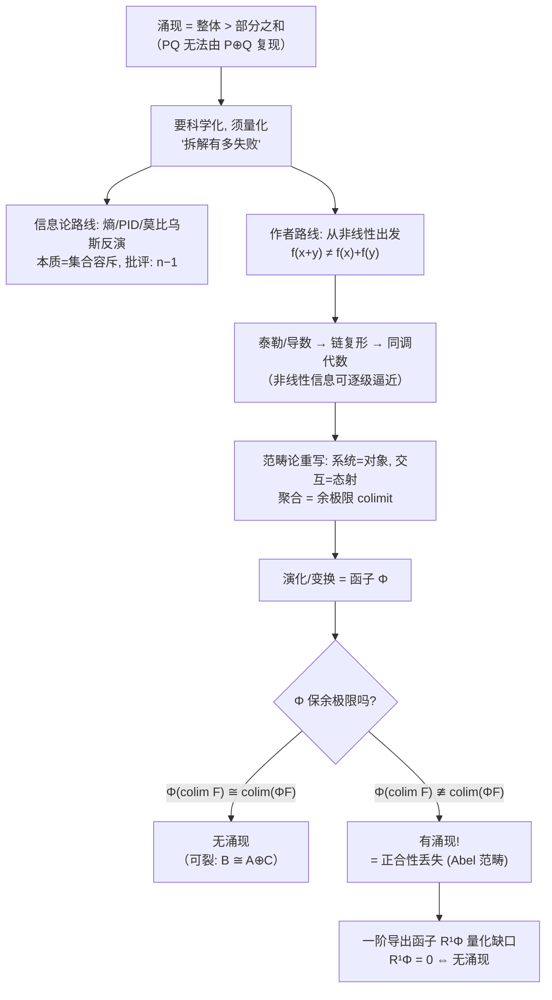

# 涌现的代数刻画——知乎 wD2Bad 同调代数视角回答详解

> [!info] 文档信息
> - **问题**：目前有哪些解释复杂系统"涌现性"的理论？（知乎）
> - **回答者**：wD2Bad（原文自述在 2025 年春节期间边听深度学习讲座边写成，日期不可考，约为 2025 年 2 月）
> - **原文链接**：https://www.zhihu.com/question/37737859
> - **写作目的**：数学薄弱者也能读懂的长文详解；并把概念接回生物熵 / AA-PMN / 模糊逻辑 ODE 课题
> - **关联笔记**：[[复杂性科学与涌现的模拟——细胞建模课题的困惑与解答]]（§1.3 曾把它列为"范畴论进路"，本文是对该行的大字精读）、[[涌现性——从简单规则到复杂世界的跨越]]、[[The entropic view of aging from thermodynamics to biology]]、[[AA-PMN网络-HGM指标验证方案]]

> [!abstract] 30 秒版（只读这段也能带走核心）
> wD2Bad 是**站在代数学立场上，批评主流涌现量化方法、并给出自己纲领**的研究者。
> 1. **他先定义涌现**：两个子系统 P、Q 组成系统 PQ 后，PQ 出现了 P、Q 各自没有、也无法用 P、Q 允许的基本操作（如直和 P⊕Q）凑出来的性质。
> 2. **他批判信息论路线**（香农熵 → 偏信息分解 PID → 莫比乌斯反演）：这些方法本质是"集合取并再减子集"（容斥原理），只会得到 "n−1 < n" 这种重言式，**遗忘了每个点（子系统）内部的结构与动力学**。
> 3. **他的正面纲领**：先看非线性（$f(x+y)\neq f(x)+f(y)$），指出刻画它的语言是同调代数；再把"系统=对象、交互=态射、聚合=余极限、演化=函子"用范畴论重写，得到涌现判据：**演化对应的函子 Φ 不保余极限**；在 Abel 范畴里这等价于**正合性丢失**，而正合性丢失的程度**可以用导出函子 R¹Φ 具体算出来**。于是：**R¹Φ = 0 ⇔ 无涌现；R¹Φ ≠ 0 ⇔ 有涌现，且非零程度=涌现的量化。**
> 4. 全文是**研究纲领而非成熟定理**：作者没有在任何真实系统上跑通完整计算，也不告诉你生物系统该选哪个范畴、哪个函子——这是留给读者的最大空白，也是你要小心的部分。

---

## 0. 读这篇文章前，先调整心态

这篇文章对你来说之所以"难"，不是因为术语多（本文会逐个拆），而是因为**它要求你换一种理解科学的方式**：

- 你习惯的语言：**方程**（ODE、模糊逻辑、数值模拟）——"算出一个数"。
- 作者习惯的语言：**结构**（范畴、函子、复形）——"描述箭头之间的关系，不问具体数值"。

这两者是数学内部的两个不同工种（分析/方程 vs 代数/结构）。作者开篇第一句其实就在划阵营：

> 熟读表示论和同调，然后静下心来好好思考这个问题，可以让你比某些假装自己在研究自然科学的群体更快理解涌现。

后半句是挑衅，可以忽略；前半句是真诚的——**他是认真的代数纲领**。阅读时请记住三条纪律：

1. **不需要一次看懂每个公式**。每条公式旁边都配了"人话版"。先读人话，公式当作"证据照片"看即可。
2. **注意区分"批评"与"主张"**。他对别人（信息论路线）的批评大多犀利且有理；他自己的主张（导出函子）则是漂亮但尚未兑现的支票。§8 会专门做批判性评估。
3. **注意区分"文章结构"与"作者伪装"**。作者有大量嘲讽和圈内梗（本文用"原文声音"引用保留），但其论证骨架是严肃的，本文帮你抽骨架。

**全篇论证骨架（作者视角）**：涌现不可还原 → 但它"不可还原到什么程度"是科学问题 → 信息论量化太弱（丢了结构） → 结构语言从非线性开始 → 非线性→求导→链复形（同调代数） → 升级到范畴论（聚合=余极限） → 涌现=演化函子不保余极限 → Abel 范畴中=正合性丢失 → 导出函子量化之。

---

## 1. 开篇：先给"涌现"一个能吵架的定义

### 1.1 原文定义（拆成三段）

> 基本单元交互作用中突然虚中恍动一般的有了什么基本结构无法表出的复杂性质。如果有 2 个子系统 [1] P, Q 组织成为复杂系统 PQ，涌现即说 PQ 产生了额外于 P, Q 的现象，并且无法通过 P, Q 容许的基本操作（例如物理上可能的 P⊕Q）来复现 [2]。

逐句人话：

| 原文 | 人话 |
|---|---|
| "PQ 产生了额外于 P、Q 的现象" | 合起来之后，出现了单独看 P、单独看 Q 都看不到的新东西 |
| "无法通过 P⊕Q 来复现" | 不是"把 P 和 Q 放在一起各自运转"（直和 = 互不干扰地并列）能解释的 |
| "虚中恍动" | 故意玄学的比喻：仿佛凭空蹦出来的性质 |

脚注也很有意思，值得看：

> [1] 一般来说是线性空间或者模，机器学习的数据构成的空间或物理的系统大致只有这几个。
> [2] 广义上来看生育其实也勉强能算吧，如果直和是手拉手显然没办法涌现小朋友出来，不过例子太恶俗了……

[2] 是全文最轻快的一个例子：两个子系统"手拉手"（直和）当然造不出新生命——但请注意，作者在这里已经把**涌现的最低标准**定成了"直和复现不了"。[1] 则暴露了作者的数学偏好：他把"系统"默认看成线性空间/模——这对他后面用表示论铺路，但对生物系统是个要打问号的假设（见 §8）。

### 1.2 作者的核心立场（全文题眼）

> 我们当然知道这整体大于局部的玄之又玄的一部分确实存在，但科学研究的意义是在于解释未知而不是**拿未知当万金油给某些无法解释的现象作遮羞布**。换句话说，我不仅知道它没办法拆解为子系统，我还希望知道它在拆解方面到底"**有多失败**"。

这句话值得刻在桌上。它的意思是：

- **涌现不是要被否认**（"整体大于部分之和"确实存在）；
- **但科学追问的是"多出来的那部分到底是什么、多到什么程度"**；
- 于是整个问题的形式变成了：**量化"拆解的失败程度"**。

> [!example] 课题接口 ①
> 这与你在 [[复杂性科学与涌现的模拟——细胞建模课题的困惑与解答]] 里给自己立的规矩完全同构："干预只作用于局部靶点，宏观熵指标从不出现在任何智能体规则里"——你也在做同一件事：**承认涌现，但拒绝拿它当黑箱遮羞布，而是设计实验去度量它**。作者的"拆解有多失败"= 你的"宏观熵减是否真由局部规则×相互作用涌现出来"。你们立场一致，只是他走向代数，你走向多智能体仿真。

---

## 2. 第一幕：为什么"信息论量化涌现"这条路不够

作者先从最主流的量化路线开刀。这一章他批评的对象，恰好与你知识库里"信息分解 / 因果涌现"这条线（[[复杂性科学与涌现的模拟——细胞建模课题的困惑与解答]] §1.3 的"计算因果进路"）高度重合——所以这一章对你不是废笔，它帮你**看清这套工具的边界**。

### 2.1 背景：信息论确实是最早的"涌现量化器"

香农熵把"不确定性/信息量"变成一个数。于是很自然地，有人想：涌现=整体信息比部分信息多出来的那块 → 用信息论差值来量化。作者承认这是"对复杂度涌现的经典量化研究始于信息论"，但补了一刀：

> 但这些量化中不显性含有构成复杂系统的组分的结构及其交互，所以仍停留在经验公式层面。

> [!math] 数学零件：香农熵 H 与两条链式法则（你一定能跟上）
> 单个变量的熵：$H(Y)=-\sum_y p(y)\log p(y)$。直觉：结果越不确定（分布越平），熵越大。
> 联合熵（两个变量一起看的信息量）：
> $$H(X,Y)=-\sum_x\sum_y p(x,y)\log p(x,y)$$
> 恒等式（链式法则）：$H(X,Y)=H(X|Y)+H(Y)$，意思是：**整体信息 = 先算 Y 的信息，再算"已知 Y 之后 X 还剩多少新信息"**——信息是可以像剥洋葱一样一层层加出来的。
> 由此推出互信息的链式法则（这就是原文引的那条）：
> $$I(X_1,X_2\,;\,Y)=I(X_1\,;\,Y)+I(X_2\,;\,Y\,|\,X_1)$$
> 人话：**"两个源合起来解释了多少 Y" = "X₁ 单独解释的部分 + 在已知 X₁ 后 X₂ 还能再补充的部分"。**（条件互信息 $I(X_2;Y|X_1)$ 就是"已知 X₁ 后，X₂ 关于 Y 还能挤出的新信息"。）

这条公式看起来平淡，但它是整章的地基——因为"涌现=信息随阶数增长"的整个论证都建立在这种**逐项累加**上。作者想说的是：这种累加方式预设了"整体信息可以由部分信息 + 修正项拼出来"，而这恰恰是涌现想挑战的。

### 2.2 被批评的目标论文（已核实）

- **Mediano, Rosas, Luppi, Jensen, Seth, Barrett, Carhart-Harris, Bor. "Greater than the parts: A review of the information decomposition approach to causal emergence." arXiv:2111.06518 (2021).** https://arxiv.org/abs/2111.06518
- 该综述的核心主张（与作者转述一致）：**涌现 = 关于系统时间演化的、无法从各子系统分别获得的信息**；并提出协同信息（synergistic information）是涌现的载体，可进一步拆成**因果解耦（causal decoupling）与自上而下因果（downward causation）**两个高阶原子——这正是你知识库里 Rosas 一系（ΦID）的思想综述版。
- 注意：这篇综述与你 [[复杂性科学与涌现的模拟——细胞建模课题的困惑与解答]] 批注④ 引的 Rosas et al. 2022 *Phil Trans R Soc A*（*Emergence as the conversion of information*）是同一阵营。**换言之，作者这一章批评的，就是你正在考虑采纳的"信息分解"工具箱。**

### 2.3 PID：把联合信息拆成四种"信息原子"

偏信息分解（Partial Information Decomposition, PID；奠基文献 Williams & Beer 2010，见你批注④）把 $I(X_1,X_2;Y)$ 拆成四项：

$$I(X_1,X_2;Y)=\underbrace{\mathrm{Red}}_{\text{冗余}}+\underbrace{\mathrm{Uniq}_1+\mathrm{Uniq}_2}_{\text{两个特有}}+\underbrace{\mathrm{Syn}}_{\text{协同}}$$

| 原子 | 人话 | 生物学直觉 |
|---|---|---|
| 冗余 Red | X₁、X₂ **各自单独**都能给出的那部分信息 | 两个靶点都能独立降的同一个熵 |
| 特有 Uniq₁ / Uniq₂ | 只有**其中一个**能给出的信息 | 只有 5-LOX 抑制才管用的那条通路 |
| 协同 Syn | **单个都给不了、必须合在一起**才出现的信息 | 双靶点组合才压得住的系统级代偿 |

于是很自然的口号：**Syn 大 = 涌现**（因为 Syn 是"只属于组合、不属于任何部分"的信息）。这正是 wD2Bad 说的"Synergy（协同）就是涌现的温床"。

### 2.4 作者的批评一：这是"集合取并 + 减子集"，本质是重言式

作者把 PID 的四分法调侃为"霍格沃茨分院"，然后指出它的底层图像：

> 从朴素集合论角度考虑：取出系统的两个子系统时，它们相交那部分、各自余下互异的部分、以及整体系统剩余构成四个很自然的分类……核心想法是集合尺度上真子集没办法 recover 全集，这是一句纯粹的重言：**n−1 < n**。

人话翻译：
- PID 的四个原子（Red/Uniq₁/Uniq₂/Syn）在集合层面恰好对应两个集合的"交、差、差、外部"四种区域——所以它本质是**在集合上做取并、再逐项减真子集**（容斥原理）。
- 容斥原理只能告诉你"全集比每个真子集大"，这是 $n-1<n$ 式的废话；**它没有告诉你"大出来的那块有没有新结构"**。
- 换句话说：PID 把"涌现"定义成"信息总量不可加"，但**不可加性本身不携带任何关于系统如何组织的解释**。

作者还用一句刻薄话点破这类"分类万能"的套路：

> 按照这个说法，我也能分类所有 C* 代数：一种可以被 K 理论分类，一种不能。

意思是：把事物分成"能被 X 解释"和"不能被 X 解释"两类，任何体系都能这么分——**分类不等于解释**。（K 理论是代数拓扑里用来分类 C* 代数的工具，这里是"拿一个词当万能标签"的讽刺。）

### 2.5 作者的批评二：那张"因果图"是伪交换图，计算根本没给出

原文那段对目标论文的"图"火力全开：

> 这文章具体怎么计算完全没有给出。而是贴了很大一张图……你起码写个映射，以及这里两个算子 $\mathcal{G}^{(k)}(\mathbf{X}_t;\mathbf{X}_{t'}) + \mathcal{D}^{(k)}(\mathbf{X}_t;\mathbf{X}_{t'})$ 到底是矩阵形式还是什么微分映射，如果是其中之一到底 maps to 了个什么。最后很难绷的是这图画出来凑巧还是个 pseudo commutative diagram。
> ……难道真的对着不同点形成的子集疯狂容斥原理再反演吗？哦哦，实际可怕 · brute force！

人话：作者认为该综述把"因果解耦 + 自上而下因果"画成一张看起来很数学的图，但**(a) 没有给出可执行的计算定义；(b) 那图经不起推敲（"伪交换图"）**；(c) 真去算的话，只能对子集暴力容斥——回到 2.4 的批评。

### 2.6 莫比乌斯反演：从"局部"反演"整体"的正面尝试，和它的失败

作者其实先给了这条路线一个正面工具——**莫比乌斯反演（Möbius inversion）**，因为 PID 和信息分解家族内部确实靠它在"信息格"上做反演：

> 什么计算可以把局部反映给整体？这里的想法是透过 Mobius 反演来实现全集和子集的局部-整体关系。也就是说，如果你想把关于某 n-尺度集合上的函数做拆分，一个想法是 $f(n) = \sum_{\text{sth} \leq n} g(\text{something})$。而 Mobius 反演天然就长这样，于是取信息熵 I 的反演就得到局部信息 g，g(n) 看上去就是局部信息在 n 这一项时的值。

> [!math] 数学零件：莫比乌斯反演（集合版，最直观）
> 假设整体函数是"对一切子集求和"得到的：
> $$F(S)=\sum_{T\subseteq S} G(T)$$
> 那么可以反解出每个子集自己的贡献：
> $$G(S)=\sum_{T\subseteq S}(-1)^{|S|-|T|}F(T)$$
> 这就是**容斥原理的正式名字**。它的用处：如果"整体量"是各部分贡献的累加，反演能逐个剥离出"每个局部贡献多少"。在 PID 中，信息原子就是在"冗余格"上做这类反演得到的。

作者的批评有三条（翻译成人话）：
1. **冗余项的贡献没被细致说明**——剥出来的"局部信息"里，重复计算的部分说不清物理/信息学含义；
2. **依然是集合论**——即使承认冗余有信息学意义（多个观测者不降低未知度），它给不出神经网络这类系统的**本质刻画**，因为系统内部结构（谁影响谁、怎么影响）从头到尾没进公式；
3. **附录摊牌了：就是容斥原理暴算**——作者讽刺说目标论文附录自己承认是 inclusion-exclusion 硬算。

然后是最狠的一击（原文）：

> 难道你全身细胞是集合论从数量上容斥反演出你的七情六欲吗？这种人体超算麻烦 V 我一台。

和结论：

> 点集上的暴算看起来不本质，我们似乎需要关注更加深层次的高阶结构。

> [!note] 这里的信息密度极高，帮你捋清
> wD2Bad 不是否定信息论/熵本身——他自己开头还亲手推导了香农链式法则。他否定的是**把"集合/分布层面的信息量比较"当作涌现的解释**。他的判词可以浓缩成一句：**"熵与 PID 度量了'信息缺了多少'，但没有度量'结构发生了什么'。"**
> 有意思的反讽：PID 数学上确实内含莫比乌斯反演（在冗余格上）——所以作者先讲信息熵 → 莫比乌斯反演 → PID 这条脉络，是在"展示对手的工具箱内部结构"，然后论证这套工具够不到动力学本质。

> [!example] 课题接口 ②（重要——关系到你批注④的取舍）
> 你正在把"头雁分子 = 高特有 Uniq + 高协同 Syn 参与度"（PID 版操作化定义）当作候选方法。wD2Bad 的批评**不否定这个定义本身**，而是警告你它的解释力上限：
> - ✅ 用 PID 给头雁分子**排序、筛候选**：可行、可发表、工具成熟；
> - ⚠️ 但别把 PID 数值直接当"涌现机制的解释"——它只告诉你"哪些变量贡献了不可加信息"，**不告诉你为什么**；
> - ✅ 补救方式正是你已在做的：**把 PID 结果放回你的 ODE 动力学里做因果验证**（对高 Syn 的组合做 do-干预，看宏观熵是否真的联动）——用机制模型补 PID 的"解释空洞"，这恰好回应了 wD2Bad 的批评。

---

## 3. 第二幕：回到非线性——作者认为的"正确的入口"

批评完别人，作者要给自己的路线打地基。他的入口很朴素：**一切涌现争论的物理根源是非线性**。而处理非线性，分析学早就给了第一件武器——求导。这一节是"动机诗"，数学上只是热身，但埋伏了全篇最关键的思想种子（同调代数）。

### 3.1 非线性最朴素的写法

> $f(x+y) \neq f(x) + f(y)$。任何凹凸函数都可以取到不等式，只需考虑 $x = \lambda t, y = (1-\lambda)s$。

人话：**线性 = 整体等于部分之和（输入可加，输出也可加）**；**非线性 = 加性被破坏**。涌现的"整体 > 部分之和"在函数语言里就是这个不等式。

> [!example] 课题接口 ③
> 你的整个模糊逻辑 ODE 模型就是一张巨大的非线性函数网：模糊规则（sigmoid 型隶属度、AND/OR 算子）保证了你模型中几乎处处 $f(x+y)\neq f(x)+f(y)$。**所以你的系统在数学上"具备涌现的可能"是必然的**——真正的科学问题是 2.4 里说的：非线性导致的不可加性里，哪些有功能意义（有序结构），哪些只是噪声。这也呼应你自己笔记里"确定性 ODE 均值场是涌现的天敌"的判断：非线性在单变量层面只产生弯曲轨迹，**涌现需要非线性×足够多的相互作用单元**。

### 3.2 泰勒级数：把非线性函数拆成"各阶导数信息的叠加"

> 假定 f 本身解析，则 $f(x)$ 可由泰勒级数 $\sum_{0\leq k\leq n}\frac{f^{(k)}(0)}{k!}x^k$ 逼近。这构成无界分次环 $\Omega:=\bigoplus_{n\geq 0}\mathbb{R}x^n$ 上的同态，每一项系数为对应阶导数。

> [!math] 数学零件：泰勒展开（你早就用过）
> $$f(x)=f(0)+f'(0)x+\frac{f''(0)}{2!}x^2+\frac{f'''(0)}{3!}x^3+\cdots$$
> 人话：**一个足够光滑的非线性函数，可以被它的"零阶信息（值）、一阶信息（斜率）、二阶信息（弯曲）、三阶信息……"逐级完整编码**。展开式的第 n 项系数就是第 n 阶导数——"各阶导数"就是"各阶信息"。
> 作者把"函数"看成"各阶导数序列"，说这构成一个**分次环**：意思是每阶导数像一层货架（0 阶、1 阶、2 阶……），而函数之间的乘法会让各阶信息按卷积方式混合。

作者想让你看见的伏笔：**既然非线性信息可以按"阶"逐级展开，那么"涌现出来的高阶信息"或许也可以按某种"阶"逐级逼近**——这就是后面谱序列思想的雏形。

### 3.3 一维世界的残酷事实：二阶微分信息自动消失

> 由于 ℝ 的切空间本质上是它自己，全体微分信息只构成一个 1-形式 $df(x)=f'(x)dx$，且 $d^2f=f''(x)dx\wedge dx=0$（这只是一维流形上造不出 2-形式，并非外微分只计算线性形式）。

> [!math] 数学零件：为什么 $d^2f=0$
> 外微分算子 d 作用在微分形式上。在实数轴 ℝ（一维流形）上：
> - 函数是 0-形式：$df = f'(x)\,dx$ 是 1-形式；
> - 对 1-形式再求外微分：$d(f'dx)=f''\,dx\wedge dx$，而 $dx\wedge dx=0$（同一个方向的"面积元"是 0——就像用一把尺子量不出面积）。
> 所以在一维上 $d^2=0$ 是**维度不够**造成的，不是定理偷懒。这个"套娃必归零"性质（$d^2=0$）是后面一切链复形机器的引擎。

### 3.4 链复形首次登场：$0\to C^\infty(\mathbb{R})\xrightarrow{d}\Omega^1(\mathbb{R})$

> 由此得到很短的链复形：$0\longrightarrow C^{\infty}(\mathbb{R})\xrightarrow{d}\Omega^1(\mathbb{R})$，其中 ker d 构成所有非正合信息（全体常值函数 ℝ）。

> [!math] 数学零件：链复形（Chain complex）——全文最核心的"机器"
> 链复形 = **一列对象 + 一列箭头，且相邻两个箭头复合恒为 0**：
> $$\cdots \xrightarrow{d_{i+2}} A_{i+1}\xrightarrow{d_{i+1}} A_i \xrightarrow{d_i} A_{i-1}\xrightarrow{d_{i-1}}\cdots \qquad\text{满足 } d_i\circ d_{i+1}=0$$
> 人话：**这是一条"信息流水线"，每个箭头都在做一次变换，而"走两步必归零"保证每一步都彻底丢弃了上一步的信息**（d²=0 就是 3.3 的性质）。
> 链复形唯一的用途：**用来测量"流水线上每级之间漏掉了什么"**——这正是同调/上同调的定义（后面 §5 会用到）：
> $$H_i=\frac{\ker d_i}{\operatorname{im} d_{i+1}}$$
> "本级没被杀死的部分 ÷ 上一级传下来的部分" = **本级真正新出现（无法由上一级解释）的信息**。

在这里，$0\to C^\infty(\mathbb{R})\xrightarrow{d}\Omega^1(\mathbb{R})$ 的意思是：从函数到 1-形式只有一级变换；ker d（被 d 杀光的函数）= 常值函数——即"完全没有变化信息"的平庸对象。

### 3.5 关键构造：把链复形"纵向拉长"成二维网格——谱序列的"页"

> 导数算子 $\mathfrak{D}: C^{\infty}(\mathbb{R})\to C^{\infty}(\mathbb{R})$ 可以**纵向拉长**这个复形，得到二维网格（横向为对微分形式的函数求导）。记第 p 行、q 列的商群 $\ker d^{p,q}/(0)$ 为 $H^{p,q}$。
> **核心发现**：我们发现导数中阻碍 $f(x+y)\neq f(x)+f(y)$ 的高阶信息正是被 $H^{p,q}$ **逐页逼近**（我为什么要说页？）。能对多维光滑/解析映射如法炮制的话，$C^{\infty}(\mathbb{R}^n)$ 态射中的非线性高阶信息自然也能被逐步逼近。**而这正是同调代数的语言所刻画的。**

> [!math] 数学零件：谱序列（Spectral Sequence）——只需直觉
> 谱序列是一种**分层逼近工具**。当你想算的某个"整体同调"太复杂，谱序列给你一本"书"：第 0 页是最粗的近似，第 1 页由第 0 页"逐格取上同调"得到，第 2 页由第 1 页再取……每一页都比上一页更接近真相，最终在某页收敛。
> 作者说"我为什么要说页？"——就是在暗示**谱序列的"页（page）"**这个术语。他真正想表达的是：**非线性造成的复杂高阶信息，可能像谱序列一样，被一页一页地剥离和逼近，而不是一锤子用某个公式"算出来"。**

请你注意：这一段是全文**气氛最浓郁但也是最"示意性"**的地方——作者没有真给你一个二维网格的完整定义，更没演示"逐页逼近非线性信息"在哪个具体例子上算到了第几页。他是用求导→复形→页的联想，为"同调代数语言适合非线性"做铺垫。真正的定理级内容要等 §5 的导出函子。

### 3.6 大模型例子：涌现 = 生成性函数的非线性

> 生成大模型需要一个尺度 S，使得低于 S 的尺度 S−ε 无论如何配合，都无法表现出 S 的 generativity。这相当于说度量 generativity 的函数 f 是非线性的：**f(S−ε) + f(ε) < f(S)**。而针对信息论以及各种纯实验室数值模拟则只关注 S 而忽视了 f 本身，从数学的角度上，我们很有理由关心 f。

人话：大模型能力涌现（能力随规模突跳）这件事，信息论/实验派只盯着"尺度 S 这个数"，但真正的数学对象是**"尺度→能力"的函数 f 的形状**——它是一个有阈值性跳跃的非线性函数（$f(S-\varepsilon)+f(\varepsilon)<f(S)$）。**要解释涌现，应该去研究 f，而不是只报告 S 处的测量值。**

> [!example] 课题接口 ④
> 这句话几乎可以直接改写进你的论文方法学：当你说"群体规模达到 N 之后出现集体代偿热点/分区有序"时，别只报告 N 这个数——**去拟合/刻画"规模 → 宏观熵下降幅度"这条响应函数，看它是否非线性、是否存在阈值突跳**。这与你在 [[复杂性科学与涌现的模拟——细胞建模课题的困惑与解答]] 里的"扫描耦合强度×异质性方差，绘制涌现图谱（找相变点）"完全一致：**你找的就是 f 的奇点**。

### 3.7 蚁群与转向：从"加性组合"到"交互的语言"

> 复杂系统无法由子系统的'加性'组合复刻，亦或复合系统难以裂解为局部，此时意味着有额外涌现的复杂度在阻碍这一切。但如果想知道复杂系统为何难解，我们不妨先观察更容易的方向：**子系统如何交互聚合**。而二十世纪拜代数拓扑兴起所赐的数学已为我们提供了描述交互的利器：**交换图与交换代数**。

人话：与其纠结"整体为什么拆不开"，不如研究"部分是怎么粘起来的"——而描述"怎么粘"的现成数学语言，是代数拓扑/范畴论里的**图和交换图**。至此，作者完成了从分析学（求导）到代数学（图/范畴）的跳跃。

---

## 4. 第三幕：范畴论最小入门（间奏一：余极限）

这是全文对新手最陡的坡。本文用最少的概念给你搭一条能走的路：**对象 → 态射 → 图表 → 锥/余锥 → 余极限 → 函子 → 涌现判据**。每一步都配"你熟悉的领域里的例子"。

### 4.1 一个思想实验：为什么"系统+交互"不能用集合表达？

两个细胞放在一起，和"两个细胞 + 它们之间分泌的介质 + 介质的扩散 + 反馈"是完全不同的对象。集合论里 {细胞A, 细胞B} 和 {细胞A, 细胞B, 介质} 的区别只是元素多少；**但生物学上真正的区别是"结构"：谁作用于谁，以什么方式。** 范畴论就是为"带着箭头的结构"发明的语言。

### 4.2 最小工具箱

| 术语 | 一句话定义 | 你的领域里的例子 |
|---|---|---|
| **对象** | 一个"东西" | 一个 ODE 状态空间、一个细胞、一条通路模块 |
| **态射（箭头）** | 两个对象之间的"关系/变换" | 靶点抑制、调控边（SIRT3→SIRT1）、状态迁移 |
| **复合** | 箭头接箭头 | A 抑制 B、B 抑制 C → A 间接去抑制 C |
| **范畴** | 一堆对象 + 箭头，且箭头可复合（满足结合律、有恒等箭头） | "所有 PMN 状态" + "所有可行迁移"构成一个范畴；"所有网络" + "网络映射"构成另一个 |

一句话：**范畴 = 只关心"什么连着什么、怎么连"，不关心"每个点具体数值"的数学。** 这正是你的代谢网络图的抽象版——你在 Cytoscape/论文图里画的就是范畴的骨架（对象=节点，态射=边）。

### 4.3 交互场景的图表示：A → C ← B

> 考虑两个子系统 A 和 B，所在系统构成一个范畴，**态射是系统间的交互**。A、B 可以需要额外第三方来承载交互（例如作为两个线性子空间通过直和的更大线性空间上的线性变换来交互），故考虑让 A、B 在 C 中"交汇"：$A\to C\leftarrow B$。引入共同前像 N 沿 $f:N\to A$、$g:N\to B$ 映射，则 C 构成图表沿 f、g 的**推出**。

拆解：
- **A、B 要交互，往往需要一个"公共平台" C**：两条代谢通路 A、B 要互相影响，通常是通过共享代谢物池/共同底物 C 来完成的——就像两个人对话需要空气作为声波介质。
- **"共同前像 N"**：A 和 B 或许还有共同的"源头/前件" N（共同的上游信号、共同的底物来源），N 分别射向 A 和 B。
- 于是整张图是 $N\to A$、$N\to B$、$A\to C$、$B\to C$ 的菱形——**推出（pushout）**。

### 4.4 图表、余锥、余极限（严格但温和的定义）

> - **图表**：范畴 C 中图表可抽象为态射 $F:J\to C$（把图中形如 $A\to C\leftarrow B$ 的部分取为 J）。
> - **余锥**：C 的一个对象 N，连带为每一个 J 中的 X 兼容的一族态射 $\phi_X:F(X)\to N$，使得 J 中的态射 $f:X\to Y$ 可被兼容地变化到 $\phi_Y\circ F(f)=\phi_X$。
> - **余极限**：图表 $F:J\to C$ 的余极限是一个具有**泛性质**的特殊余锥 $(L,\phi_\alpha)$，使得对任意余锥 $(N,\psi)$ 都存在唯一态射 $u:L\to N$ 满足 $u\circ\phi_\alpha=\psi$。

> [!math] 数学零件：余极限（colimit）——"所有局部信息融合后的最终收束"
> 直接给抽象定义会把人劝退。给你三个递进的理解：
> 1. **集合的例子（最直觉）**：一族集合"并起来"得到的并集，就是这族集合最简单的余极限——每个集合都映射进并集，并集是最小的、能装下它们全部的对象。
> 2. **图的例子**：A、B 两个系统要融合成"包含二者交互"的 C，融合结果 C 就是那个"把所有交互可能性都兑现了的最小系统"——它必须同时接收来自 A 和 B 的箭头（否则交互没落地），又不能再小（否则有交互漏掉）。
> 3. **泛性质的一句话版**：**任何其他"融合方案"都自动、唯一地通过余极限分解**——所以余极限是"交互的完成形态"、"当前系统交互能产生的一切可能性的天花板"。
> 形式记号：$\mathrm{colim}\,F$（或 $\varinjlim F$）。

作者用一句黑话收束（并注明"语出 lww"——他在引用讨论者的话）：

> 余极限之所以重要，是因为现在我们将子系统的交互表示为余锥，则余极限截断余锥并将任意余锥分解到唯一确定态射 u。它能告诉我们关于余锥们自己演化的信息"收敛"到什么状态。……**涌现说明在复杂系统演化下，后续状态出现不可仅仅用当前子系统状态表示的情况。而余极限道尽当前系统交互构成的一切可能性。**

> [!example] 课题接口 ⑤（把范畴论翻译回你的 ABM）
> 你设想的"多 PMN 智能体 + 共享介质场耦合"（[[复杂性科学与涌现的模拟——细胞建模课题的困惑与解答]] 思路 A）在范畴论里就是：N = 共同的炎症微环境/底物供给，A、B = 两个 PMN 智能体，C = 加了耦合介质后的整个系统。**"余极限"= 在给定局部规则与耦合方式下，群体能到达的一切状态空间**。
> 作者那句话翻译成你的话就是：**如果群体在某一时刻出现了不在"余极限"（局部规则×耦合的封闭包）里的状态，那就真出鬼了；而所谓涌现，恰恰是"演化的下一状态，单靠当前子系统状态（的加性组合）表示不出来"——但"当前子系统交互的余极限"早已把这个可能性空间写死了。** 所以：涌现不在规则之外，而在"规则×交互的组合爆炸"之内——这与你在笔记里写的"宏观行为不出现在任何一条局部规则里，只在运行中出现"完全同构（涌现 ≠ 违反规则，涌现 = 规则组合出的不可约结果）。

### 4.5 函子：把整张图打包搬走的"霸道态射"

> 有一个打包交换图表的超级霸道态射 Φ 还顺手破坏了我们的态射。这个霸道态射不是别的，正是范畴论里面的**函子**，它是范畴之间的态射，每次都把图表整个打包。

函子 = **范畴之间的映射**，它把 A 范畴里"对象→对象、箭头→箭头"整体搬到 B 范畴，且保持复合关系。关键能力：**函子会"打包"整张图表**——你把一张交互图丢给它，它把整张图变成一个整体映像。

**于是涌现的定义第一次变成了一条可判定的代数等式：**

$$\Phi\left(\varinjlim F\right)\;\ncong\;\varinjlim\left(\Phi F\right)$$

> 对系统进行变换产生涌现，变换对应的函子 Φ 为**不保余极限的函子**……这在范畴论里是已有成熟定义的概念：**非余连续函子**（或在伴随函子定理条件下不具备右伴随）。

人话解释这条等式（这是全文第一次出现"判别式"）：
- 左边：**先让系统按规则演化/聚合（取余极限），再对结果做变换 Φ**（如：先让群体耦合运行到稳定态，再粗粒化观测）；
- 右边：**先分别对每个子系统做变换 Φ，再把变换后的子系统聚合**（如：先各自粗粒化每个细胞，再看它们"合并"出来的宏观动态）；
- 若左右不相等：**"先整体后变换" ≠ "先变换后部分拼装"** → 说明变换 Φ 破坏了"局部能拼出整体"的性质 → **涌现出现**。

> [!example] 课题接口 ⑥（这条对你极其关键）
> 请把 Φ 想成你的**粗粒化/观测函数"从微观 ODE 状态 → 宏观熵"**，左边是"让整个 PMN 群体真实运行后测宏观熵"，右边是"先对每个细胞独立做简化，再假装它们能简单拼出群体熵"。
> - 若左右近似相等 → 群体层面没有超出单细胞的不可约结构（你的宏观熵只是单细胞熵的平均）——**无涌现**；
> - 若左边显著 ≠ 右边 → 群体运行产生了单细胞简化模型拼不出来的宏观行为——**有涌现**。
> 这正是你笔记里"思路 D（Hoel 有效信息 / Rosas 三闭合）"想验证的事，只是 Hoel 用概率与有效信息、wD2Bad 用函子与余极限——**两种语言在度量同一件事：宏观层是否"自足/不可由微观加性重构"**。你在论文里可以说："该检验与因果涌现文献（Hoel 2013）同构，此处采用函子语言表述。"

### 4.6 为什么"Abel 范畴上余极限正合"是承上启下的关键事实

> 不失一般性（其实现实里基本没非 Abelian），在 **Abelian 范畴**上工作，取加性函子 $\Phi(A\oplus B)=\Phi(A)\oplus\Phi(B)$。因为交换代数和同调代数已经告诉我们**余极限在 Abelian 范畴上就是正合**。（引 Stacks Project 及 MSE 参考链接）

> [!math] 数学零件：Abel 范畴（Abelian category）——只需要认识"模范畴"
> Abel 范畴 = **既能做加法结构、又有核与余核的范畴**。最典型的例子：所有"环 R 上的模"构成的范畴（线性空间的推广）。你不需要懂细节，只需知道：**在 Abel 范畴里，同调代数（核、像、商、正合列、导出函子）全部成立**——这是下一章能"算"的前提。
> 作者引用的 Stacks Project tag [07N7](https://stacks.math.columbia.edu/tag/07N7)（已核实）：这是"模的余极限"一节，其中 Lemma 10.8.8 说**滤过（directed）系统的余极限保持正合性**（余极限与同调可交换），而 Example 10.8.9 明确给出**一般余极限不正合**的反例。所以精确的说法是：**滤过余极限正合；一般余极限只是右正合**——作者行文取的是"在合适条件下余极限是正合的"这个版本。这条引理是下一章的钥匙：正因为（滤过）余极限本身正合，函子 Φ 施加后正合性若丢失，**锅只能由 Φ 来背**——丢失量就是涌现量。

---

## 5. 第四幕：正合性——把"涌现"变成可计算问题（全文核心）

如果你只打算精读一个部分，就是这一章。前面的所有铺垫（非线性→链复形→余极限）在这里合流，汇成一个干净判据。

### 5.1 正合列：精确测量"链条断了多少"

> Abelian 范畴可看成域-向量空间/环-模的抽象。关键例子：线性空间 U, V, W 有线性映射 $V\xrightarrow{g}W\xrightarrow{f}U$ 且 $f\circ g=0$，这丢失了 f 和 g 的信息。若 ker f 刚好和 im g 同构，则称映射列**正合**；若 ker f 更大使得 im g 真包含其中，则**非正合**。

> [!math] 数学零件：正合（exact）——"像=核"
> 一串箭头 $A\xrightarrow{f}B\xrightarrow{g}C$ 满足 $g\circ f=0$（走两步归零，即 f 的像全被 g 杀掉）时，称它是"复形"。问：**f 的像（传下来的信息）和 g 的核（g 要杀的信息）是否严丝合缝？**
> - 若 $\operatorname{im}f=\ker g$：**正合**——流水线一级传一级，中间不丢也不多，信息严丝合缝。写成 $0\to A\to B\to C\to 0$ 的正合列。
> - 若 $\ker g$ 比 $\operatorname{im}f$ **大**：**非正合**——g 想杀的东西比 f 传下来的多，**多出来的那块（ker g 里不属于 im f 的部分）就是"凭空多出来、无法由上游解释"的信息**。
> 同调/上同调就是算这个缺口：$H=\ker g\,/\,\operatorname{im}f$。**非正合 = 有缺口 = 有不可还原的新东西。**

作者顺带埋了个圈内梗（可跳过）：微分拓扑里的"恰当形式"就是"正合形式"；还吐槽了 Brauer 群正合列 $0\to\mathrm{Br}(k)\to\bigoplus_v\mathrm{Br}(k_v)\to\mathbb{Q}/\mathbb{Z}\to0$（这是代数数论里刻画"代数结构的障碍"的正合列，"障碍藏在第三项"）。看不懂不影响主线——只要记住：**同调代数的世界观里，"新东西/障碍物"都以正合列缺口的形式出现，而且可以被算。**

### 5.2 可裂正合列 ⇔ 没有涌现

> 有一类特殊正合列称之为 **splitting/可裂**：$A\to B\to C$ 正合时 $B\cong A\oplus C$。"回顾开头，**这其实已经意味着复杂系统 B 中没有涌现 A、C 以外的复杂度**。"

> [!math] 数学零件：可裂（split）
> 若长正合列 $0\to A\to B\to C\to 0$ 中的中间对象 B 恰好同构于两端"直和" $A\oplus C$，称该正合列可裂。人话：**B 虽然被切成两段，但两段可以无摩擦地拼回去，拼回去就是原样——没有任何"胶水产生的新东西"。**
> 作者的一击必杀：**可裂 = 涌现缺席的形式化定义。** 因为涌现的定义（§1.1）就是"PQ 无法用 P⊕Q 复现"，而可裂正合列恰恰是 $B\cong A\oplus C$——整体能由部分直和复现，于是涌现为零。

### 5.3 函子的"正合性格"：正合 / 左正合 / 右正合

> - **正合函子**：对正合列 $0\to A\to A'\to A''\to 0$ 施加 Φ 后依然正合。
> - **左正合**：只保持 $0\to\Phi(A)\to\Phi(A')\to\Phi(A'')$ 正合。
> - **右正合**：只保持 $\Phi(A)\to\Phi(A')\to\Phi(A'')\to 0$ 正合。
> "我们注意到**余极限本身只是右正合**，如果想要进一步涌现复杂度，我们还需要破坏正合。" 优势："**非正合其实可以用同调代数具体算出。**"

人话：
- **函子的"性格"描述它对待链条的态度**：正合函子=完美搬运工（链条搬过去还是严丝合缝）；左正合/右正合=只保一端严丝合缝（另一端的缺口可能产生）。
- **"演化"这种运算天然只是右正合** → 演化过程中本来就容易"产生缺口" → 缺口的多少，就是涌现的多少。
- 最关键的一句是最后：**"非正合其实可以用同调代数具体算出"**——缺口不再是哲学感叹，而是有成熟算法（导出函子）的对象。

### 5.4 导出函子：测量"正合损失了多少"的专用仪器

> 导出函子是用于计算**正合损失程度**的代数方法，只依赖函子自身代数结构。步骤：在 Abelian 范畴里延长单边正合列（**解消**，按左右正合分为投射或内射解消），再计算延长映射列的 $\ker_{i+1}/\operatorname{im}_i$ 来恢复损失的正合程度。

> [!math] 数学零件：右导出函子 RⁿΦ 的构造（概念版三步）
> 假设 Φ 是左正合函子（演化算子通常如此）。想测它"左端之外丢了多少正合性"：
> 1. **解消（resolution）**：把对象 A 装进一条"教科书级完美链条"（内射解消）：
> $$0\to A\to I_0\to I_1\to I_2\to\cdots$$
> 2. **施加 Φ**：让不完美的搬运工 Φ 去搬这条完美链条（此时链条不再严丝合缝，出现了缺口）：
> $$0\to\Phi(I_0)\xrightarrow{d^1}\Phi(I_1)\xrightarrow{d^2}\Phi(I_2)\to\cdots$$
> 3. **取上同调（算缺口）**：定义
> $$\mathrm{R}^n\Phi(A)=H^n(\Phi(I_\bullet))=\frac{\ker d^{n+1}}{\operatorname{im}d^n}$$
> 且因为 Φ 左正合，有 $\mathrm{R}^0\Phi(A)=\Phi(A)$（第 0 级缺口为零，Φ 在"起点"不丢信息）。
> 人话总结：**导出函子 = "把对象放进标准参考系，用不完美算子搬一遍，再称量搬丢了多少"的标准化流程。** 它只依赖函子 Φ 自身的代数结构，不需要任何外部信息——所以它是"内禀"的度量。

### 5.5 核心结论（全文的心脏，值得背下来）

> **R¹Φ(A) = 0 意味着正合，此时函子 Φ 所表示的演化并无涌现。就这样，我们用导出函子从理论上计算出了涌现的量化过程。用函子描述系统的演化，则演化中涌现的出现与否由一阶导出函子刻画。非平凡导出函子之于 Abelian 范畴，就类似非线性映射之于线性空间，为涌现提供了机会。如果系统本身有配套的线性表示，那么计算导出函子就给出了对涌现的量化。**

三个层次拆给你：
1. **判据**：演化函子 Φ 的一阶导出函子 $\mathrm{R}^1\Phi(A)=0$ ⇔ 演化无涌现；≠0 ⇔ 有涌现，**且缺口大小（商空间 $\ker d^2/\operatorname{im}d^1$ 的维度）就是涌现的量化**。
2. **类比句（原文最漂亮的一句）**："非平凡导出函子之于 Abel 范畴，就类似非线性映射之于线性空间"。解释：线性空间上，线性映射不会创造新方向（像空间永远被定义域撑住）；非线性映射会"弯出"定义域里没有的东西。Abel 范畴里，正合函子是"线性"的；**导出函子非零 = 这个函子有"非线性"的一面 = 它会凭空产生定义域里没有的（涌现）结构**。
3. **兑现条件**："如果系统本身有配套的线性表示"——注意这个前提（§6 的箭图表示就是试图给神经网络这类系统找"配套的线性表示"）。

### 5.6 直觉重述（术语清零版）

> 把"系统演化"想成一条流水线：原料（子系统状态）进入，经过若干道工序（交互、反馈、聚合），产出（宏观状态）。如果每道工序都"严丝合缝"（正合），那么产出严格等于原料的加工之和——没有涌现。
> 但如果某道工序（对应函子 Φ）会**凭空多杀东西或凭空多出东西**（非正合），那么产出里就有"不是任何一道工序单独能解释"的部分。**一阶导出函子 R¹Φ 就是专门称量"第一道无法解释的缺口"的秤**：秤读数 0 = 没有涌现；读数非 0 = 有涌现，读数越大涌现越强。

> [!example] 课题接口 ⑦（把判据映射到你的双靶点干预）
> 这是一个"精神类比"，不是可直接落地的算法（为什么，见 §8）：
> - A = 疾病态 PMN 网络状态；Φ = "施加干预组合（如 COX-2 抑制 + 5-LOX 抑制）后看系统状态"的映射；
> - 若 $\Phi$ 是"线性/可加"的（单靶效果直接相加=双靶效果），则 $\mathrm{R}^1\Phi=0$，**没有协同涌现**——双靶只是两个单靶的直和；
> - 若双靶产生了单靶各自绝对产生不了的系统行为（你复现 2007 论文时看到的"COX 通路代偿性放大"、组合干预下的通量再分配），则 $\mathrm{R}^1\Phi\neq 0$——**组合干预的协同本身就是一种涌现**。
> 这条类比给你的论文一个"高阶叙事选项"：**把"多靶点协同（synergy）"形式化定义为"干预映射的一阶导出函子非零"**——当然，要真正写进论文，你还需要给出可计算的具体实现（§8 会告诉你为什么现在做不到、以及替代方案）。

---

## 6. 附录路线：如果真想算——箭图表示与神经网络表示论

作者在附录里给了"兑现支票"的草图：对神经网络这类系统，如何构造"配套的线性表示"以便真算导出函子。你的 AA 代谢网络在结构上比神经网络更接近箭图，所以这一段对你不是纯观赏。

### 6.1 箭图（quiver）= 有向图

> 待计算系统为线性空间或模时，态射自动获取矩阵表示，故需要矩阵和表示论语言。引用论文：《The Representation Theory of Neural Networks》（Armenta & Jodoin, Mathematics 2021, 9(24):3216，**已核实**，DOI: [10.3390/math9243216](https://doi.org/10.3390/math9243216)，作者来自加拿大舍布鲁克大学数学系与计算机系）。

> [!math] 数学零件：箭图（quiver）
> 箭图 = **顶点集 $Q_0$ + 箭头集 $Q_1$ + 源/靶映射 $s,t:Q_1\to Q_0$**。人话：就是带箭头的有向图——**你的 AA 代谢网络（PLA2→AA→COX/5-LOX→前列腺素/白三烯→受体→转录因子）在结构上就是一个箭图**。

### 6.2 表示：给每个顶点一个线性空间、每条箭头一个线性映射

> **范畴化表示** Rep(Q)：对象是取定某点 $q\in Q_0$ 表示得到的线性空间 $V_q,W_q$；态射是逐对象的线性变换 $\phi:V_q\to W_q$，满足对任意 $f\in Q_1$ 有交换图（即 $\phi$ 与箭头映射相容）。

> [!math] 数学零件：箭图的表示（representation）
> 一个表示 = **给每个节点配一个线性空间（记录该节点"能装多少状态"），给每条边配一个线性映射（记录该边"如何把上游状态搬到下游"），并要求沿任何路径走结果一致**（交换性）。人话：**把网络图"装进"线性代数，让每个节点活过来成为一个会运算的载体。**
> 对神经网络来说：输入层数据=顶点上的线性空间，权重矩阵=箭头上的线性映射，激活函数=额外附加结构——这正是 Armenta & Jodoin 论文的结论：**"神经网络是带激活函数的箭图表示"，且这个表示不是近似而是精确匹配**。

### 6.3 路径代数：让"复合路径"本身成为乘法

> 偷代数拓扑名词，称一族态射的复合为一条路径，两条路径的组合构成乘法（"还记得基本群是什么吗（笑）"）。这使交换图本身构成**幺半群**。……线性空间所在域 k 赋予 Rep(Q) 以 k-mod 结构。

> [!math] 数学零件：路径代数与模块
> 把箭图里所有"路径"（边走边复合）收集起来，路径之间可以首尾相接（乘法）——这就造出一个代数（路径代数 kQ）。**箭图的一个表示 ⇔ 路径代数上的一个模**。这是表示论的基本等价，它把"图的结构"翻译成"代数的结构"，从而一切环论/同调代数工具都能用。
> "还记得基本群是什么吗（笑）"——基本群也是"路径的复合类"构成的群；作者在提示：图上的"路径组合"思想在代数拓扑里源远流长。

### 6.4 内射解消的"剧情梗概"（公式展示，不要求掌握）

作者给出对箭图表示 $V=(V_q)_{q\in Q_0}$ 构造内射解消的骨架：

$$0\to V\to\bigoplus_{q\in Q_0}I_q\otimes V_q\to\bigoplus_{f\in Q_1}I_{t(f)}\otimes V_{s(f)}\to 0$$

其中 $I_q:=\mathrm{Hom}(e_q k(Q),k)$ 是"标准内射对象"（用对偶 + 张量把每个节点的状态空间"垫高"成可以接收一切映射的对象）；第二个箭头把 V 嵌入这堆"大对象"；第三个箭头（ν）作用类似"微分"（对箭头 f 同时作用左右两端，即 $(v^\vee\otimes p)\mapsto v^\vee\otimes(f\circ p)-f(v^\vee)\otimes p$——注意这个形式与 $d(fg)=df\cdot g+f\cdot dg$ 的莱布尼茨律同构）。

### 6.5 最终公式（只看"它长什么样"即可）

施加演化函子 Φ 后，取一阶上同调得到：

$$\mathrm{R}^1\Phi(V)=H^1 I^{\bullet}(V)=\left.\Phi\left(\bigoplus_{f\in Q_1}I_{t(f)}\otimes V_{s(f)}\right)\middle/\operatorname{im}(\nu)\right.$$

而 $\mathrm{R}^0\Phi(V)=\Phi(V)$。作者最后说："象征性放几个图，我不太喜欢二次元美少女就不 po 了"——**他自己也承认附录只是象征性的**。请注意：到这里为止，**全文仍然没有任何一个真实系统的完整数值计算**。这条"支票"至今没有在神经网络（或任何真实网络）上被完整兑现——这是你在决定是否跟进前必须知道的事实。

---

## 7. 全篇论证链一张图 + 三个追问

**三个追问与简答**：

| 追问 | 简答 |
|---|---|
| 为什么是同调代数？ | 因为非线性信息可"按阶展开"（泰勒伏笔），而同调代数是唯一把"缺口/障碍"变成可计算对象的成熟机器（$H=\ker/\operatorname{im}$） |
| 为什么是导出函子？ | 函子 = 演化/变换；正合性 = 信息严丝合缝；导出函子 = 称量正合损失的标准仪器，且只依赖函子自身结构（内禀） |
| 为什么是 R¹ 而不是 R²、Rⁿ？ | 一阶缺口是"第一处解释不了的地方"，是涌现的门槛（R⁰=Φ 恒无损失）；更高阶 Rⁿ 对应更复杂的迭代涌现，作者把门槛设在 R¹ |

---

## 8. 批判性评估（写论文之前，必须冷静看的部分）

### 8.1 作者的贡献（值得肯定，也是你该学的）

1. **把问题形式化得很干净**：从"整体>部分之和"这种口号，推进到"拆解失败程度可量化"的精确问题——这个**问题意识**和"可裂 ⇔ 无涌现"的形式化，是有教学价值的洞察。
2. **对信息论路线（PID/因果涌现综述）的批评击中要害**：PID/ΦID 确实是"集合/分布层面"的工具，解释不了机制；"分类≠解释"的警告适用于所有把度量当理论的论文——包括你要写的论文。
3. **给"协同/涌现"一个代数上的"非平凡性"判据**：把多靶点协同类比为"函子的非线性（导出函子非零）"，作为**叙事与直觉**非常有力。
4. **示范了"批评要有建设性"**：他批评别人时总同时给出"如果是我，我会从哪条路走"。

### 8.2 软肋与局限（诚实清单）

| # | 软肋 | 说明 |
|---|---|---|
| 1 | **无真实算例** | 全文没有对任何真实系统的完整导出函子计算；附录自己承认"象征性" |
| 2 | **没有"选函子"的处方** | 对真实生物系统：范畴是什么？对象是什么？演化函子 Φ 是哪条映射？——这些是建模的核心决策，作者没有给任何操作指南。"R¹Φ 量化涌现"只有在 Φ 选好之后才有意义，而选 Φ 的难度≈整个建模难度 |
| 3 | **"线性表示"假设对生物学存疑** | 作者自己也限定"如果系统有配套的线性表示"。代谢网络的状态是连续浓度+酶活，勉强可线性化；但"细胞类型/分化状态"这类离散、结构性状态没有自然的线性表示。强行线性化会丢失你想保留的"内蕴信息"（讽刺的是这正是他批评 PID 的话） |
| 4 | **与主流可计算理论脱节** | 主流（计算力学 ε-机器、因果涌现 EI、ΦID、统计力学）都有数值算法和实证；本文路线缺乏同等的算法落地，社区认可度低 |
| 5 | **对"机制解释"的贡献仍是纲领级** | 即使算出了 R¹Φ ≠ 0，它告诉你"有不可加结构"，和 PID 一样**不告诉你生物学机制**——需要你的 ODE/模糊规则来补 |
| 6 | **文风副作用** | 大量嘲讽与圈内梗（Brauer 群、Hilbert 90、K 理论）服务于"圈内人设"，对严肃引用需剥离 |

### 8.3 三种流派坐标系（接你已有笔记）

| 流派 | 代表人物/工具 | 量化对象 | 可落地性（对课题） |
|---|---|---|---|
| 代数/同调进路（本文） | wD2Bad：导出函子 | 正合性损失 | ★☆☆☆☆ 无算法、无处方 |
| 经典复杂系统进路 | 许铁：分形/相变/SOC/网络 | 临界态与幂律 | ★★★☆☆ 定性+统计工具成熟 |
| 计算因果进路 | Rosas（ΦID/三闭合）、Hoel（EI）、Crutchfield（ε-机器） | 信息/因果封闭性 | ★★★★☆ 有算法、有实证、有现成 Python 生态（disyco、pyinform 等） |

结论先行：**代数进路适合当"理论高度"与"叙事框架"，不适合当主方法**；主方法仍是计算因果进路（你已在用）+ 你的机理 ODE。

> [!note] 一个立场提醒（与作者共鸣）
> 作者开篇那句"科学研究的意义在于解释未知而不是拿未知当万金油"应当成为你的论文审稿防御第一原则——它同时适用于：(a) 审稿人说"你的熵减是涌现吗"时（你有六环论证链，见 [[复杂性科学与涌现的模拟——细胞建模课题的困惑与解答]] 批注①）；(b) 你自己未来引用"涌现"一词时——**每次使用都必须伴随可操作的度量与对照**。

---

## 9. 对我的课题：5 个具体借鉴 + 3 个不采纳

### ✅ 借鉴 1：把"协同=涌现温床"与 PID 四原子作为头雁分子的筛选语言
作者对 PID 的批评不否定其筛选功能。头雁分子 = 高 Uniq（单打独斗有效）+ 高 Syn 参与度（组合必要成员），排除纯 Red（可替代）——与你批注④的 PID 版定义一致，本文为其补上"为什么 PID 只能筛、不能解释"的边界意识。

### ✅ 借鉴 2："先整体后变换 ≠ 先变换后拼装"作为涌现检验的另一种表述
把"粗粒化映射 Φ（微观 ODE 状态 → 宏观熵）"代入 $\Phi(\mathrm{colim}\,F)\ncong\mathrm{colim}(\Phi F)$：群体运行后的宏观熵 ≠ 单细胞简化拼出的宏观熵，即宏观层不可约。写作上可声明"与 Hoel 因果涌现的宏观>微观同构，此处用函子语言表述"——增加理论纵深。

### ✅ 借鉴 3："f(S−ε)+f(ε)<f(S)"提醒你报告响应函数而非只报阈值
规模/异质性扫描时，报告"规模→熵减幅度"完整响应曲线及其非线性形状（阈值、突变点），而非只报"到 N 出现涌现"。这直接对应你"涌现图谱/找相变点"的计划。

### ✅ 借鉴 4："点集暴算遗忘每个点的内蕴信息" = 你相对纯熵指标路线的护城河
香农熵/OSE/SCENT 都是对"分布/集合"的统计；你的模糊 ODE 保留了"每个变量怎么变、受谁调控"的机制信息。论文可写一句定位语：**"统计熵指标回答'无序多少'，本模型回答'无序如何产生、如何被干预'——前者是分布快照，后者是机制动力学。"**（这也回应 [[The entropic view of aging from thermodynamics to biology]] 中 MEAI 的线性加权局限。）

### ✅ 借鉴 5："导出函子只依赖函子自身结构"的思想 → 指标应内禀、可审计
他的"内禀度量"理想（不引入外部参照）提醒你：宏观熵指标的定义应预先冻结、独立于药物智能体（你批注①第 6 环"指标预注册"），让"涌现度量"像导出函子一样成为**系统自身性质的函数**，而不是训练过程的产物。

### ⚠️ 不采纳 1：导出函子作为主方法（现阶段）
无算法、无生物处方、审稿人不认。正确用法：Methods 或 Discussion 里一段"与同调代数纲领的对话"（若审稿人恰好是数学背景可加分），不进 Results。

### ⚠️ 不采纳 2：放弃 PID/有效信息去追同调代数
信息分解家族（Williams & Beer 2010 → Rosas 2022 → Yang 2025）是可计算、有先例、能对话的成熟路线（见你批注④）；同调进路是"画饼"。时间分配应向可落地方向倾斜。

### ⚠️ 不采纳 3：用"涌现不可还原"为不建模开脱
作者自己都反对拿未知当遮羞布。你的六环论证链（弱涌现定义 Bedau 1997 → 局部性公理 → 消融对照 → 统计系综 → 信息闭合 → 指标预注册）已经把"涌现"变成可证伪命题——保持这个标准，不要因为读了本文就退回玄学表述。

---

## 10. 术语速查表（按出现顺序）

| 术语 | 一句话解释 | 直觉锚点 | 章节 |
|---|---|---|---|
| 涌现 Emergence | 整体出现部分没有、且不能由部分"加出来"的性质 | 蚁群智能 > 单蚁 | §1 |
| 直和 ⊕（direct sum） | 互不干扰地并列两个空间 | 手拉手 ≠ 生孩子 | §1 |
| 香农熵 H | 不确定性的度量 | 分布越平熵越大 | §2 |
| 链式法则 | 联合信息 = 逐层剥洋葱 | 先算 Y，再算 X 的新增 | §2 |
| 条件互信息 | 已知一部分后还能挤出的新信息 | 剔除已解释的部分 | §2 |
| PID 偏信息分解 | 把联合信息拆成 冗余/特有×2/协同 | 四学院 | §2 |
| 协同 Syn | 只属于组合的信息 | 双靶才有、单靶没有 | §2 |
| 莫比乌斯反演 | 从"整体=子集贡献之和"反解每个子集贡献 | 容斥原理的正式名字 | §2 |
| 容斥原理 | 加加减减去重 | | §2 |
| 非线性 | f(x+y)≠f(x)+f(y) | 加性被破坏 | §3 |
| 泰勒级数 | 用各阶导数逐级逼近函数 | 各阶导数=各阶信息 | §3 |
| 微分形式/外微分 d | 广义的"微分"，d²=0 | 一维造不出面积元 | §3 |
| 链复形 | 一列对象+箭头，走两步必归零 | 信息流水线 | §3、§5 |
| 同调/上同调 H | ker/ im，测量流水线缺口 | 缺口=新信息 | §3、§5 |
| 谱序列 | 逐"页"取同调逼近真相的机器 | 书，一页比一页精确 | §3 |
| 范畴 | 对象+箭头（态射）的世界 | 只关心谁连着谁 | §4 |
| 态射 | 对象间的箭头 | 调控边 | §4 |
| 函子 | 范畴间的映射，打包整张图 | 霸道打包机 | §4 |
| 图表/图 F:J→C | 范畴里的一片箭头结构 | 交互场景 | §4 |
| 余锥 cocone | 一组指向同一目标的相容箭头 | 众流汇海 | §4 |
| 余极限 colimit | 交互收束的"最终完成形态"（泛性质） | 交互可能性的天花板 | §4 |
| 推出 pushout | 沿公共部分粘合（一种余极限） | 共享平台 | §4 |
| Abel 范畴 | 有加减法+核余核的范畴（模范畴） | 同调代数的健身房 | §4、§5 |
| 正合列 exact seq | im=ker，严丝合缝 | 流水线无泄漏 | §5 |
| 可裂 split | B≅A⊕C，可无摩擦拆回 | 涌现缺席 | §5 |
| 左/右正合函子 | 只保链条一端严丝合缝 | 一端完美的搬运工 | §5 |
| 导出函子 RⁿΦ | 称量正合损失的标准仪器 | 内禀的"涌现秤" | §5 |
| 内射/投射解消 | 标准参考链条 | 教科书样本 | §5、§6 |
| 箭图 quiver | 有向图（顶点+箭头） | 你的 AA 网络 | §6 |
| 表示 representation | 顶点配空间、箭头配映射 | 把图装进线性代数 | §6 |
| 路径代数 kQ | 路径复合构成乘法 | 基本群的近亲 | §6 |

---

## 11. 资料与延伸阅读

**原文引用的关键文献（均已核实、链接可访问）**：
- Mediano PAM, Rosas FE, Luppi AI, Jensen HJ, Seth AK, Barrett AB, Carhart-Harris RL, Bor D. *Greater than the parts: A review of the information decomposition approach to causal emergence.* arXiv:2111.06518 (2021). https://arxiv.org/abs/2111.06518 —— 本文 §2 批评的对象（信息分解/因果涌现综述）
- Armenta M, Jodoin P-M. *The Representation Theory of Neural Networks.* Mathematics 2021, 9(24):3216. DOI: [10.3390/math9243216](https://doi.org/10.3390/math9243216) —— 本文 §6 的神经网络=箭图表示论文
- The Stacks Project, Section 10.8 (tag 07N7) *Colimits*. https://stacks.math.columbia.edu/tag/07N7 —— 滤过余极限正合 / 一般余极限不正合（Lemma 10.8.8 与 Example 10.8.9）

**本库关联**：
- [[复杂性科学与涌现的模拟——细胞建模课题的困惑与解答]] —— 三流派总览 + 你的六环论证链 + PID 调研（批注④）
- [[涌现性——从简单规则到复杂世界的跨越]] —— 米歇尔/唐尼/瓦格纳三本书视角的涌现科普
- [[AA-PMN网络-HGM指标验证方案]] —— 头雁分子指标体系落地方案
- [[The entropic view of aging from thermodynamics to biology]] —— 刘光慧熵框架（MEAI），与本文 §8.3 的"统计熵 vs 机制动力学"对照
- [[2007 炎症代谢网络模拟]] —— 你复现的单细胞 ODE（多靶点协同现象的载体）

**进阶学习路线（按顺序，每级配一门课/一本书）**：
1. 线性代数补强（奇异值分解、直和、线性映射）——你已具备大部分；
2. 范畴论直觉入门：推荐 3Blue1Brown 的 Essence of Category Theory 系列视频（B 站有翻译），先建立"对象/态射/函子"的图像；
3. 同调代数最小集：只要"正合列→链复形→上同调→导出函子"四个概念，可看 Weibel《An Introduction to Homological Algebra》第 1 章 + 各校讲义；
4. 若要落地到网络系统：读 Armenta & Jodoin 2021 的引言与结论（跳过公式），再看你批注④的 PID 文献。
5. 若只想用结论：回到 §9 的五条借鉴即可，不需要亲自进入同调代数。

#source/网页 #topic/生物熵 #topic/ODE建模 #topic/信息分解 #topic/智能体化

## AI 整理记录（2026-09-11 · 每日整理智能体）
- 归位：Clippings/ → 日常阅读与记录/（范畴论进路精读，含课题可借鉴点与不采纳清单）
- 建议关联：[[复杂性科学与涌现的模拟——细胞建模课题的困惑与解答]]（§1.3 范畴论进路行的精读展开）、[[The entropic view of aging from thermodynamics to biology]]（统计熵 vs 机制动力学对照）
- 归类：#topic/复杂性与涌现 #use/建模输入

---

## 关联笔记（AI 自动标注，供网络图可视化）
- [[药研视界｜从“数字细胞”到AI虚拟细胞： 虚拟细胞的研究进展与未来应用]]（共享主题：AA代谢网络、AI4S、ODE建模、PMN）
- [[00-我的思考]]（共享主题：AA代谢网络、AI4S、ODE建模、PMN）
- [[WHOLISTIC-批判性解读与课题连接]]（共享主题：AA代谢网络、AI4S、ODE建模、PMN）
- [[02-批注处理-2026-09-12]]（共享主题：AA代谢网络、AI4S、ODE建模、PMN）
- [[00-毕设工作交接汇报-2026-09-18]]（共享主题：AA代谢网络、ODE建模、PMN、SIRT轴）
- [[05-批注处理-2026-09-16]]（共享主题：AI4S、ODE建模、PMN、SIRT轴）
- [[90-本书与课题的连接点]]（共享主题：AA代谢网络、AI4S、ODE建模、PMN）
- [[多组学驱动建模与干湿闭环设计蓝图]]（共享主题：AA代谢网络、AI4S、ODE建模、PMN）
